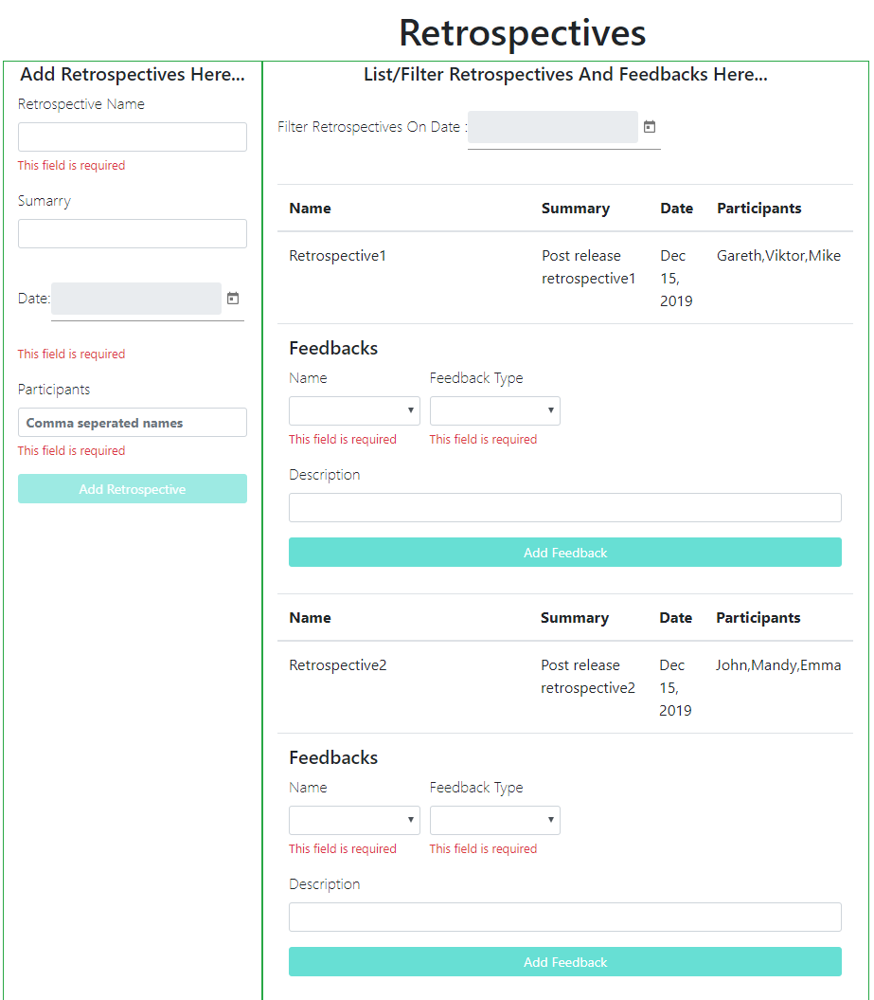
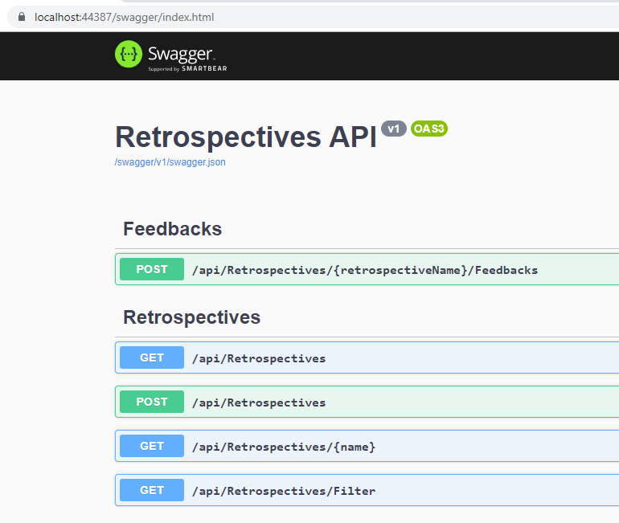

## Retrospective Feedback application 
#### Tech Stack: 
1) UI is done in Angular 8 using Visual Code and Angular CLI
2) Web API in Asp.Net Core 3.1 taking advantage of built-in dependency injection framework using Visual Studio 2019.
   Swagger is added for UI testing. NLog is used for logging and Newtonsoft is used for serialization. 
   Unit tests done using NUnit and Moq.

#### How to run:

Assumption is made that the source code from GIT is downloaded at below mentioned folder location:
C:\repos\

1) After downloading source code from GIT, Open RetrospectiveData solution from Visual Studio 2019 which will load web api project **RetrospectiveDataAPI** and unit test project with .net Core 3.1 framework - build and run the api project from visual studio.
   It should launch Swagger UI on https://localhost:44387/swagger/index.html - keep this running before you start UI
   **Note:** It may work in other versions of visual studio with .net Core 3.1 framework installed but I have not tested it.

2) Assuming Angular project is downloaded at below mentioned folder location then run below 2 commands on Angular CLI 
   C:\repos\RetrospectiveData\AngularUI\RetrospectiveAngularUI>**npm install**
   C:\repos\RetrospectiveData\AngularUI\RetrospectiveAngularUI>**ng serve --open**
   Angular UI should launch on: http://localhost:4200/

3) Once the UI is launched then it will be loaded with retrospective data which is available at below mentioned json file which serves as the database for this application:

**C:\repos\RetrospectiveData\RetrospectiveDataApi\Data\Retrospectives.json**

**Note:** This file already exists in project folder with sample data and its path is configured in appsettings.json file of web api - you can leave this file name in appsettings.json as it is or if you wish then you can update the file name or folder location in appsettings.json but you need to make sure the new file MUST exist within application's base directoty i.e "C:\\repos\\RetrospectiveData\\RetrospectiveDataApi" in this case.
I am aware that minor improvement needs to be done in web api project to fix this issue but I have left it for now as this is not the main focus of the requirement spec.

#### Below is how the UI looks like. It is divided in 2 sections:
1) **Left section:** To add new retrospectives. When you add new retrospective then the list on right side will get refreshed with all available retrospectives including the new one just added
2) **Right section:** 
    1) To list available retrospectives
    2) Filter retrospectives on date selection and 
    3) Add new feedbacks under respective retrospective. Feedback can be added only for participants belonging to its respective retrospective item. Feedback Type dropdown is populated using enumeration values.
    4) As per spec document, assumption is made that existing feedbacks/newly added feedbacks won't be shown on UI. If you need to see existing feedbacks/newly added feedbacks then you can refer to data file which can be
       found at C:\repos\RetrospectiveData\RetrospectiveDataApi\Data\Retrospectives.json

Below is how the level of components structured in Angular:
1) **Level1:** index.html
2) **Level2:**--------> app-module
3) **Level3:**----------------> retrospective.service
4) **Level3:**----------------> app-retrospectives component
5) **Level4:**------------------------> app-retrospective component
6) **Level4:**------------------------> app-retrospective-list component
7) **Level5:**--------------------------------> app-feedback-item

Improvements that could have been done in Angular project:
1) Base url of web api used could have been configured instead of hardcoding in retrospective.service.ts file
2) Basic alert window will appear on click of 'Add' buttons for successfull insert or validatinn response message when it can't insert - this could be improved by using 3rd party components like https://www.npmjs.com/package/ngx-toastr
3) Once search on date is done then there is no functionality to clear selected date value and fetch all retrospective data - you need to refresh the page to get all the retrospective data. This coud be improved by adding 'Clear' date button or by making the date component editable.

**Web API:**

#### Checklist:
1) Logging configured to log in Bin's output folder - log folder location can be changed in NLog.config file in web api project: Done using NLog
   Note: Only exception errors are logged. 
2) Api is configurable: Done, Filepath where the data is saved by repository is configured
3) Add only Retrospective data without Feedback: Done
4) Add Feedback to existing retrospective item: Done
5) Get all retrospective: Done
6) Get retrospective when filtered by retrospective date: Done
7) Get retrospective when filtered by retrospective name: Done - this will be used to return location url in response header when post method is called - Angular UI is not using this method as this is something extra functionality and not expected to be used as per given specification in task document
8) Exception handling where applicable: Done
9) Return correct Http response with relevant status code for bad request, success response with data, success response with no context, error response for internal server error: Done
10) Implemented Async throughout and made sure there is no blocking async call: Done
11) Unit Tests: Done for Get and Post methods of web api - there is scope to add more unit tests
12) Configure serializer to get data in xml or json: Done
13) Implement dependency Injection and follow repository pattern: Done
14) Swagger configured for testing and added configuration for swagger documentation to describe the API: Done
15) Enumeration used for **Feedback Type** and accordingly serialization handled so that client application receives sensible string values for enums instead of receiving integer enums
16) Constants used for repeated string message: Done
17) API routing configured with correct verbs: Done
18) Controllers implemented to associate parent and child API's routing path: Done
19) Make sure that exception stack trace from web api are logged in log file but they are not passed to client application - only sensible error message passed to client application explaining reason of failure: Done
20) Add xml formatter to get web api response in either xml/json depending on the values in client application's accept header value: Done
